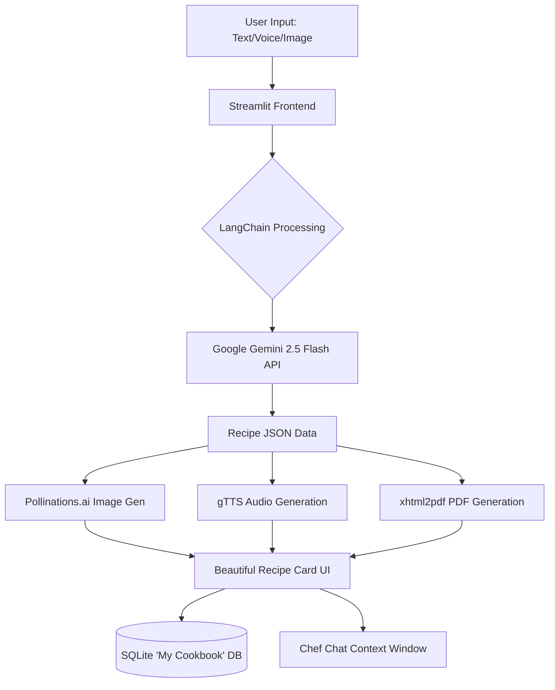

# 🍳 Recipe Craft AI

Recipe Craft AI is an advanced, multilingual, AI-powered culinary assistant built with Streamlit and the Google Gemini API. It transforms your available ingredients, food cravings, or even images of your fridge into beautifully crafted, highly detailed recipes. 


*(Please add a demo GIF of your app here!)*

Whether you are a beginner looking to cook something quick or an advanced home chef seeking inspiration, Recipe Craft AI guides you through the entire process with beautiful visuals, step-by-step cooking modes, and an interactive AI Chef Chat.

## ✨ Key Features

- **🧠 Multiple Search Modes:**
  - **By Ingredients:** Type or speak the ingredients you have on hand.
  - **By Recipe Name:** Know what you want? Just name the dish!
  - **By Image:** Upload a picture of your fridge or pantry, and the AI will identify the ingredients and craft a recipe for you.
  - **Visual Selection:** Click and select common ingredients from a visual grid.
- **🌍 Multilingual Support:** Fully supports English, Hindi, and Marathi (UI, voice input, and recipe output).
- **🎤 Voice Interactions:** Use your microphone to dictate ingredients, recipe names, dietary preferences, or chat with the AI Chef.
- **📸 AI Image Generation:** Automatically generates an appetizing, highly detailed image of your crafted dish.
- **👨‍🍳 Interactive Chef Chat:** Have a question about a substitution or technique? Chat directly with the AI about the specific recipe you just generated.
- **🔪 Step-by-Step Cooking Mode:** A distraction-free, guided cooking mode that reads the steps out loud to you as you cook.
- **📖 My Cookbook:** Save your favorite generated recipes and their chat histories to your personal, persistent SQLite cookbook.
- **🖨️ Export Options:** Download your recipe as a beautifully formatted PDF.
- **📊 Nutritional Macros:** Get estimated Calories, Protein, Carbs, and Fat for every generated meal.

## 📸 Screenshots

| Recipe Generator | Interactive Chef Chat |
| :---: | :---: |
|  |  |
| **Cooking Mode** | **My Cookbook** |
|  |  |

*(Create an `assets` folder in your repo and replace the paths above with your actual screenshots!)*

## 🏗️ System Architecture

The following diagram illustrates how user requests are processed by the various AI components in our pipeline:



## 💡 Technical Highlights & Challenges Solved

Building Recipe Craft AI presented a few unique engineering challenges that we successfully solved:

1. **Robust JSON Parsing from LLMs:** Ensuring the AI outputs strict, parseable JSON for rendering the recipe cards, even when provided with complex or blurry image inputs. This was solved by utilizing robust prompt engineering and regex-based fallbacks.
2. **Parallel Task Execution:** Generating Text-to-Speech (audio) and formatting the PDF synchronously caused UI blocking. This was solved by utilizing Python's `concurrent.futures.ThreadPoolExecutor` to run heavy I/O operations simultaneously in the background.
3. **Handling Multimodal Inputs:** Integrating text, base64-encoded images, and audio transcriptions dynamically into the LangChain pipeline to interact seamlessly with the Gemini 2.5 Flash model.
4. **State Management & Persistence:** Injecting context into the Chef Chat so that the AI remembers the exact recipe details and user preferences across multiple turns, and persisting this state across Streamlit reruns.

## 🚀 Getting Started

### Prerequisites

- Python 3.8+
- A Free Google Gemini API Key. Get one from [Google AI Studio](https://aistudio.google.com/app/apikey).

### Installation

1. **Clone the repository:**
   ```bash
   git clone https://github.com/yourusername/Recipe_Craft_AI.git
   cd Recipe_Craft_AI
   ```

2. **Install the required dependencies:**
   Make sure you have all the required libraries installed. You can install them via pip:
   ```bash
   pip install streamlit langchain-google-genai langchain-core python-dotenv streamlit-mic-recorder SpeechRecognition xhtml2pdf gTTS
   ```

3. **Set up Environment Variables (Optional):**
   Create a `.env` file in the root directory and add your Google API key. Alternatively, you can input the key directly into the app's sidebar when it launches.
   ```env
   GOOGLE_API_KEY=your_api_key_here
   ```

### Running the Application

Start the Streamlit server:
```bash
streamlit run main_gemini.py
```
The application will open in your default web browser (usually at `http://localhost:8501`).

## 💡 How to Use

1. **Setup:** Enter your Google Gemini API Key in the sidebar settings. Select your preferred language (English, Hindi, or Marathi).
2. **Choose a Mode:** Select how you want to generate a recipe (Ingredients, Recipe Name, Image, or Visual).
3. **Customize:** Add optional filters like Cuisine Preference, Meal Type, Skill Level, Maximum Cooking Time, and Dietary Restrictions.
4. **Generate:** Click "Suggest Recipe". The AI will generate a beautiful recipe card complete with an AI-generated image, nutritional macros, and chef tips!
5. **Interact:** 
   - Enter **Cooking Mode** for step-by-step audio guidance.
   - Use the **Chef Chat** tab to ask questions about the recipe.
   - Click **Save to Cookbook** to store the recipe, or download it as a PDF.

## 🛠️ Technology Stack

- **Frontend / UI:** Streamlit
- **Backend / AI:** Python, LangChain, Google Gemini API (`gemini-2.5-flash`)
- **Speech-to-Text:** `SpeechRecognition`, `streamlit-mic-recorder`
- **Text-to-Speech:** `gTTS` (Google Text-to-Speech)
- **Image Generation:** Pollinations.ai API
- **PDF Generation:** `xhtml2pdf`
- **Database:** SQLite (for My Cookbook)

## 🤝 Contributing

Contributions, issues, and feature requests are welcome! Feel free to check the issues page.

## 📜 License

This project is licensed under the MIT License.
